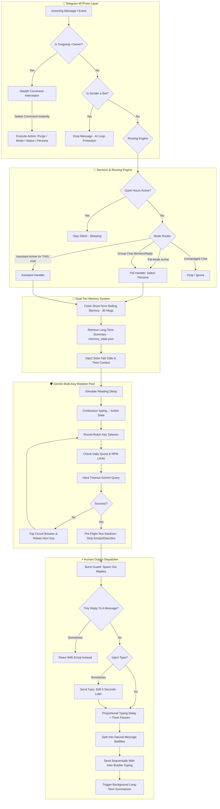

<div align="center">

# 👻 GhostGram PRO
### *Next-Gen Autonomous AI Telegram Userbot & Stealth Companion*

<p align="center">
  
  
  
  
  
  
  
</p>

<p align="center">
  <a href="#-core-features"><b>✨ Features</b></a> •
  <a href="#-stealth-command-matrix"><b>🎮 Commands</b></a> •
  <a href="#-ai-modes--persona-engine"><b>🎭 Personas</b></a> •
  <a href="#-human-like-simulation-engine"><b>⚡ Simulation</b></a> •
  <a href="#-quiet-hours--anti-detection-behavior"><b>🌙 Anti-Detection</b></a> •
  <a href="#-dual-tier-memory-architecture"><b>🧠 Memory</b></a> •
  <a href="#-quick-start--installation"><b>🚀 Quick Start</b></a> •
  <a href="README_FA.md"><b>🇮🇷 نسخه فارسی (روح‌گرام)</b></a>
</p>

---

<p align="center">
  <b>GhostGram</b> is a production-grade, stealth, autonomous Telegram userbot that bridges your personal account directly with <b>Google Gemini AI</b>.<br/>
  It chats naturally in Persian or English, adopts swappable personalities, simulates realistic human reading &amp; typing behavior, splits long answers into natural message bubbles, <b>sleeps at night</b>, <b>makes the occasional typo and fixes it</b>, remembers long-term context, understands photos/voice/video/PDFs, and executes self-destructing secret commands leaving zero trace.
</p>

---

</div>

<details>
<summary><b>📑 Table of Contents (Click to explore)</b></summary>

- [✨ Core Features](#-core-features)
- [🎮 Stealth Command Matrix](#-stealth-command-matrix)
- [🎯 Assistant Scoping (`666` vs `666 all`)](#-assistant-scoping-666-vs-666-all)
- [🏗️ System Architecture](#️-system-architecture)
- [🎭 AI Modes & Persona Engine](#-ai-modes--persona-engine)
- [⚡ Human-Like Simulation Engine](#-human-like-simulation-engine)
- [🌙 Quiet Hours & Anti-Detection Behavior](#-quiet-hours--anti-detection-behavior)
- [🧬 Dual-Tier Memory Architecture](#-dual-tier-memory-architecture)
- [🛡️ Enterprise Gemini Engine & Key Pool](#️-enterprise-gemini-engine--key-pool)
- [🧹 Ghost Purge (Message Cleaner)](#-ghost-purge-message-cleaner)
- [🚀 Quick Start & Installation](#-quick-start--installation)
- [⚙️ Configuration Reference (.env)](#️-configuration-reference-env)
- [💾 State Files & Migrations](#-state-files--migrations)
- [🔒 Security & Zero-Leak Export](#-security--zero-leak-export)
- [🗺️ Roadmap](#️-roadmap)
- [📄 License & Disclaimer](#-license--disclaimer)

</details>

---

## ✨ Core Features

<table>
  <tr>
    <td width="50%">
      <h3>🕶️ Self-Destructing Stealth Codes</h3>
      <p>Control the bot from any chat using 3-digit secret codes (<code>777</code>, <code>000</code>, <code>666</code>, <code>444</code>, <code>999</code>, <code>121</code>, <code>122</code>) that <b>immediately auto-delete</b> upon delivery, leaving zero trace to other members.</p>
    </td>
    <td width="50%">
      <h3>🤖 Dual Core AI Operating Modes</h3>
      <p>Toggle between <b>Pal Mode</b> (conversing informally in your own tone) and <b>Assistant Mode</b> (a polite 24/7 secretary for incoming DMs) — now with <b>per-chat or global scoping</b>.</p>
    </td>
  </tr>
  <tr>
    <td width="50%">
      <h3>🎭 Dynamic Multi-Persona Engine</h3>
      <p>Load unlimited custom personas from <code>personas/*.txt</code> and swap them on the fly (<code>777 lust</code>, <code>777 sarcastic</code>, <code>777 poetic</code>, <code>777 angry</code>) with zero downtime.</p>
    </td>
    <td width="50%">
      <h3>🕵️ Autonomous Group Lurker (Auto-Engage)</h3>
      <p>Periodically analyzes group discussions via structured JSON output and naturally chimes into interesting debates at randomized human intervals.</p>
    </td>
  </tr>
  <tr>
    <td width="50%">
      <h3>⚡ Ultra-Realistic Human Behavior</h3>
      <p>Proportional reading delay, <b>length-proportional typing time up to 45s</b>, random thinking pauses, and <b>automatic splitting of long replies into separate message bubbles</b>. Robotic AI giveaways are stripped before sending.</p>
    </td>
    <td width="50%">
      <h3>🌙 Sleep Schedule & Anti-Detection</h3>
      <p>Goes silent at night (<code>121</code>), occasionally sends a <b>typo and edits it seconds later</b>, sometimes <b>reacts with an emoji instead of replying</b>, and never answers a dozen chats in the same second (<code>122</code>).</p>
    </td>
  </tr>
  <tr>
    <td width="50%">
      <h3>👁️ Multimodal Understanding</h3>
      <p>Understands photos, voice notes, video notes/videos (~18 MB) and PDF/text documents — not just plain text.</p>
    </td>
    <td width="50%">
      <h3>🧠 Dual-Tier Rolling Memory</h3>
      <p>A 30-message short-term rolling window with sentence-boundary truncation, plus an automatic background long-term memory compressor powered by Gemini.</p>
    </td>
  </tr>
  <tr>
    <td width="50%">
      <h3>🛡️ Enterprise Multi-Key Pool</h3>
      <p>Round-robin rotation across unlimited Gemini API keys, daily quotas, RPM throttling, a 3-strike circuit breaker, and strict timeout protection.</p>
    </td>
    <td width="50%">
      <h3>🔌 Zero-Touch Add-On Architecture</h3>
      <p>Behaviour modules install themselves and register their own secret codes on the client. <code>main.py</code> is never modified, and a failing add-on can never take the bot down.</p>
    </td>
  </tr>
</table>

---

## 🎮 Stealth Command Matrix

> [!IMPORTANT]
> **Owner-Only Security**: All stealth codes are strictly restricted to messages sent from your own account (`event.out`). Any command you send **deletes itself immediately**, and a short confirmation is silently posted to your **Saved Messages** (auto-deleted after a few seconds).

| Code | Scope | Action |
|---|:---:|---|
| `777` / `777 <persona>` | This chat | Pal Mode ON (autonomous alter-ego) |
| `000` | This chat | Pal Mode OFF |
| `000 all` | Global | Pal Mode OFF everywhere |
| `777 engage [min]` | Group | Auto-Engage lurker ON (default 20 min) |
| `777 engage auto` | Group | 🧠 **Smart Engage**: measures chat speed and targets ~5% bot presence (2–120 min) |
| `777 engage off [all]` | Group / Global | Auto-Engage OFF |
| `666` | This chat | Assistant Mode ON **for the current chat only** |
| `666 all` | All DMs | Assistant Mode ON for every private chat, current and future |
| `444` | This chat | Assistant muted here (other DMs keep working) |
| `444 all` / `444 کل` | All DMs | Assistant OFF everywhere |
| **`121`** | **Global** | 🆕 🌙 **Quiet Hours** — status, schedule, ad-hoc sleep/wake, per-chat exemptions |
| **`122`** | **Global** | 🆕 🧬 **Human Behavior** — typo simulation, reaction-instead-of-reply, burst guard |
| `!مسدود` (reply) | Global | 🚫 Blacklist a user — the assistant never replies to them again (`!مسدود 123456` also works) |
| `!آزاد` (reply) | Global | ✅ Remove a user from the blacklist |
| `!استیکر <description>` (on sticker reply) | Global | 🎭 Teach a sticker: explain what it means so the bot can send it when fitting |
| `!استیکر لیست` | Global | 🎭 List all taught stickers |
| `!استیکر حذف` (on sticker reply) | Global | 🎭 Remove a taught sticker from the sendable pool |
| `222 [hours]` | This chat | 📋 Catch-up summary of what you missed (default 12h, max 72h) |
| `112 <question>` | Anywhere | 🌐 Web search via Google Search grounding (longer timeout) |
| `111` / `111 <prompt>` | Reply target | Smart reply to the quoted message, optionally following your instruction |
| `555 <instruction>` | This chat | ⏰ Smart reminder — `555 ساعت 21 به علی بگو تماس بگیره` · `555 تا ۲ ساعت دیگه دارو بخور` |
| `333` | This chat | Reset short-term + long-term memory for this chat |
| `999` / `999 <n>` | This chat | Ghost Purge — delete all (or the last N) messages you sent |
| `555` (bare) | This chat | Live status dashboard (auto-deletes) |
| `888` | This chat | Help menu |

### 🔔 Silent Feedback & Error Reporting

- Every stealth command is confirmed in your **Saved Messages** and auto-deleted — zero traces in the target chat.
- Engine/send failures are reported to **Saved Messages**, so a headless Railway deployment never fails silently (disable with `NOTIFY_ERRORS=0`).

---

## 🎯 Assistant Scoping (`666` vs `666 all`)

Assistant activation used to be all-or-nothing. It is now **two-layered**, so you can let the secretary handle one specific person without exposing every DM to it.

| Command | Result |
|---|---|
| `666` | Enables the assistant **only in the chat where you sent it**. Repeat it in each chat you want covered. |
| `666 all` | Enables the assistant for **all private chats**, including people who message you for the first time later. Aliases: `666 کل`, `666 همه`, `666 همه‌چت‌ها`. |
| `666 <anything else>` | Rejected with a warning — a typo can never silently switch you into global mode. |
| `444` | Mutes the assistant in this chat (also removes it from the per-chat enabled list). |
| `444 all` | Fully disables the assistant: clears global mode, the per-chat list, and mutes. |

The `555` dashboard tells you exactly which layer is active, plus how many chats are individually enabled.

> [!WARNING]
> **One-time migration.** State files written before this change are upgraded on first boot and the assistant is switched **off** so it cannot silently keep answering every DM. After upgrading, send `666` in the chats you want, or `666 all` once to restore the previous behavior. Blacklists and muted chats are preserved.

---

## 🏗️ System Architecture



---

## 🎭 AI Modes & Persona Engine

### 1. Pal Mode (Autonomous Alter-Ego)
When active (`777`), GhostGram assumes your identity. It learns your slang, avoids robotic emojis, references your shared conversation history, and responds naturally. In group chats it stays silent until directly addressed or mentioned.

### 2. Assistant Mode (Digital Secretary)
Activated per chat with `666` or globally with `666 all`. It greets contacts, handles inquiries, takes messages, and tells them when you will be available. Mute individual conversations with `444`.

### 3. Auto-Engage / Lurker Mode
With `777 engage <interval>`, GhostGram observes group conversations silently. At randomized intervals it feeds recent context into Gemini with a structured JSON schema; if an engaging question or debate is found, it joins in naturally. `777 engage auto` picks the interval for you based on how fast the group actually moves.

### 4. Dynamic Persona Switching
Add custom `.txt` files to `personas/` to unlock instant runtime personality switching:

```
personas/
├── normal.txt          <- Default conversational tone
├── assistant.txt       <- Polite secretary tone
├── sarcastic.txt       <- Witty, sarcastic humor (`777 sarcastic`)
├── poetic.txt          <- Dramatic, poetic style (`777 poetic`)
├── academic.txt        <- Formal scientific tone (`777 academic`)
├── angry.txt           <- Short-tempered, direct tone (`777 angry`)
├── drunk.txt           <- Unfiltered casual style (`777 drunk`)
└── lust.txt            <- Warm, affectionate tone (`777 lust`)
```

> [!TIP]
> **Hot-Swapping**: Create `personas/philosopher.txt` while the bot is running and use it immediately with `777 philosopher` — zero downtime.

---

## ⚡ Human-Like Simulation Engine

The biggest tell of an AI userbot is not *what* it writes — it is *how fast* it writes. A 400-character paragraph appearing after 3 seconds is impossible for a human thumb. The sending pipeline is therefore fully humanized:

```
[Incoming Text] ──► [Reading Delay ~40ms/char, capped] ──► [Continuous typing… action]
                                                                     │
[Outgoing Text] ◄── [Split Into Bubbles] ◄── [Proportional Typing Delay + Pauses] ◄─┘
```

1. **Proportional reading delay** before the bot even starts typing, so it looks like the message was actually read.
2. **Length-proportional typing time** on a non-linear curve, with an upper bound of **45 seconds** instead of the old hard 7-second clamp. Short replies stay snappy; long ones take realistically long.
3. **Random thinking pauses** mid-composition, so the `typing…` indicator flickers the way a real person's does.
4. **Automatic message segmentation**: replies longer than the threshold are split at sentence boundaries and sent as **separate bubbles**, with a short typing pause between each — exactly how people actually text. Code blocks and stickers are never split.
5. **Anti-AI formatting sanitizer**: strips markdown lists, emojis, HTML tags, and Arabic diacritics that typically give away AI-generated text.

**Approximate timing:**

| Reply length | Typing time |
|---|---|
| ~5 chars | ~1.2 s |
| ~50 chars | ~15 s |
| ~150 chars | ~50 s (split into bubbles) |
| 400+ chars | capped at 45 s per bubble |

Every number above is tunable through `HUMAN_*` environment variables — see the configuration reference.

---

## 🌙 Quiet Hours & Anti-Detection Behavior

Timing is only half the problem. A userbot that is **awake 24/7**, **never makes a mistake**, and **answers ten people in the same second** is still obviously a machine. Two self-installing add-ons fix exactly that, and both are tunable **live** — no redeploy needed.

| Module | Code | What it removes |
|---|:---:|---|
| `quiet_hours.py` | `121` | "It replied at 4 AM in two seconds" |
| `human_behavior.py` | `122` | "It never typos, never just reacts, and answers everyone at once" |

> 📖 **Full reference:** [`docs/HUMANIZATION.md`](docs/HUMANIZATION.md) — every command, every knob, the send pipeline, and a troubleshooting table.

### 🌙 Quiet Hours (`121`)

The AI goes silent during a night window you control from any chat.

| Command | Effect |
|---|---|
| `121` | Status: window, the bot's local clock, time until it wakes |
| `121 01:00 09:00` | Set the sleep window and enable it |
| `121 on` / `121 off` | Enable / disable |
| `121 tz +03:30` | Set the timezone offset used for the window |
| `121 sleep 90` | Sleep right now for 90 minutes (e.g. you are in a meeting) |
| `121 wake 60` | Stay awake 60 minutes, even inside the sleep window |
| `121 now` | Cancel a manual sleep/wake override |
| `121 allow` | Toggle an exemption for this chat — it gets replies even at night |

`23:30`, `2330` and `23` are all valid, Persian digits are accepted, and windows crossing midnight work correctly.

> [!IMPORTANT]
> Quiet Hours only silences **automatic** replies (Pal, Auto-Engage, Assistant). **Your own secret codes always work** — `111`, `112`, `222`, `555`, `999` behave identically at 4 AM and at noon.

### 🧬 Human Behavior (`122`)

1. **Typo simulation & correction** — with a small probability the bot swaps, drops or doubles a letter, then a few seconds later either **edits the message** (Telegram shows the `edited` marker, a very strong human signal) or sends a `*correction` follow-up. URLs, mentions, numbers and multi-line replies are never touched.
2. **Reaction instead of reply** — when the reply would be a throwaway line (`خخخ`, `باشه`, `مرسی`) and it is a reply to a specific message, the text is dropped and the bot just **reacts with a fitting emoji**. Questions are always answered as text; if the reaction fails, it falls back to sending normally.
3. **Burst guard** — a global rate limit and minimum gap between automatic replies, so ten incoming messages do not produce ten instant answers.

| Command | Effect |
|---|---|
| `122` | Status of all three behaviours |
| `122 on` / `122 off` | Enable / disable the whole package |
| `122 typo 8` | Typo probability in percent |
| `122 style edit\|star\|mixed` | Typo correction style |
| `122 react 20` | Reaction-instead-of-reply probability in percent |
| `122 burst 3 60` | At most 3 automatic replies per 60 seconds |
| `122 spacing 6` | Minimum 6 seconds between two automatic replies |
| `122 reset` | Restore defaults |

### 🔌 How they attach

Both modules are imported at the end of `pal_manager.py` and install themselves:
`quiet_hours` wraps the auto-reply decision predicates, `human_behavior` wraps
`TelegramClient.send_message` on top of `typing_helper`'s humanized patch, and
both register their secret code lazily on the client. **`main.py` is not
modified at all**, and if an add-on fails to import the bot logs a warning and
keeps running exactly as before.

The startup log confirms both are live:

```
🌙 Quiet Hours ready — ❌ غیرفعال | کد 121
🧬 Human Behavior ready — ✅ غلط 8٪ | واکنش 22٪ | سقف 3/60ث
```

---

## 🧬 Dual-Tier Memory Architecture

```
                                  CONVERSATION HISTORY
                                           │
             ┌─────────────────────────────┴─────────────────────────────┐
             ▼                                                           ▼
   [Short-Term Memory]                                         [Long-Term Memory]
• Sliding window of 30 messages.                             • Background AI summarizer.
• Smart sentence-boundary truncation.                        • Runs automatically every 30 messages.
• Preserves immediate context & reply chains.                • Compresses key facts into persistent JSON.
• Instant zero-latency fetch.                                • Survives restarts & sliding window drops.
```

- **Short-Term Memory**: the last 30 messages with formatted sender tags, reply chains, and timestamps. Long messages are truncated at natural sentence boundaries (`MAX_MESSAGE_SEGMENT_CHARS`).
- **Rolling Long-Term Memory**: every 30 messages, an asynchronous background Gemini task compresses important facts into `memory_state.json`. Future prompts include this condensed memory.
- **Memory Wipe (`333`)**: atomically resets the cutoff timestamp, wiping short-term and long-term memory for that specific chat.

---

## 🛡️ Enterprise Gemini Engine & Key Pool

- **Multi-Key Round-Robin**: supply unlimited Gemini API keys in `apis.txt` or `.env`.
- **Per-model limits**: configure with `GEMINI_MODELS="name:rpm:rpd,..."`, falling back to `DEFAULT_MODEL_RPM` / `DEFAULT_MODEL_RPD`.
- **Daily Quota Management**: daily request counts are tracked in `api_usage.json` with a safe ceiling below Google's limit.
- **Circuit Breaker**: a key failing 3 consecutive times is quarantined for 3 hours.
- **Hard Timeout**: prevents hanging requests by switching to the next available key (`GEMINI_TIMEOUT`, and a longer `SEARCH_TIMEOUT` for grounded web search).

---

## 🧹 Ghost Purge (Message Cleaner)

Need to erase your presence? Send `999`:
- Locates and deletes all messages sent by you in the current chat.
- Uses high-speed batch deletion (50 messages per API call).
- Handles Telegram `FloodWaitError` with automatic exponential backoff.
- The trigger command `999` deletes itself before the purge begins.

---

## 🚀 Quick Start & Installation

### Option A: Railway (recommended for 24/7)

1. Fork/clone this repo and create a Railway service from it.
2. Create a **Volume** and mount it at `/app/data` — without it, memory, reminders, mode state, and your `121`/`122` settings are wiped on every restart.
3. Run `python3 gen_session_string.py` **on your own machine** and paste the output into the `SESSION_STRING` variable.
4. Set `API_ID`, `API_HASH`, `GEMINI_API_KEYS`, `OWNER_ID`.
5. Deploy. The startup log prints the active Pal/Assistant state and which stealth codes are listening.

> [!TIP]
> If Railway shows **"GitHub Repo not found"** under the connected branch, the Railway GitHub App has lost access to the repo. Go to <https://github.com/settings/installations> → Railway → grant access to this repository, then disconnect/reconnect the source repo and redeploy.

### Option B: 1-Click Interactive Setup Wizard (Windows)

```powershell
# Double-click setup.bat or run:
python setup.py
```

### Option C: Manual / Local Installation

```bash
# 1. Clone repository
git clone https://github.com/parhambepe/ghostali.git
cd ghostali

# 2. Create and activate a virtual environment
python -m venv venv
# Windows:
venv\Scripts\activate
# Linux/macOS:
source venv/bin/activate

# 3. Install dependencies
pip install -r requirements.txt

# 4. Configure environment
cp .env.example .env

# 5. Authenticate with Telegram
python login.py

# 6. Start GhostGram
python main.py
```

### Option D: Docker & Docker Compose

```bash
docker compose up -d --build
docker compose logs -f
```

### Option E: 1-Click 24/7 Linux VPS Deployment

`deploy.bat` (Windows) and `deploy.sh` (Linux) bundle the project, upload it over SSH/SCP, install dependencies, and configure a persistent `systemd` service.

1. In `.env`, set `VPS_IP`, `SSH_USER`, `SSH_PORT`.
2. Run the deploy script.
3. The project is deployed to `/opt/ghostgram`, `ghostgram.service` is enabled, and live logs are streamed.

---

## ⚙️ Configuration Reference (.env)

```ini
# =================================================================
# 📱 TELEGRAM API CREDENTIALS (https://my.telegram.org/apps)
# =================================================================
API_ID=12345678
API_HASH=abcdef0123456789abcdef0123456789
PHONE_NUMBER=+1234567890
OWNER_ID=123456789
PERSONA_NAME=شایان

# =================================================================
# 🧠 GEMINI API CONFIGURATION (https://aistudio.google.com)
# =================================================================
GEMINI_API_KEYS=AIzaSyA...Key1,AIzaSyB...Key2
MODEL_NAME=gemini-3.5-flash-lite
# Optional per-model limits: "name:rpm:rpd,name:rpm:rpd"
GEMINI_MODELS=
DEFAULT_MODEL_RPM=15
DEFAULT_MODEL_RPD=200
SESSION_NAME=ghostgram_session

# =================================================================
# ☁️ RAILWAY / CLOUD DEPLOYMENT (recommended for 24/7)
# =================================================================
# Run ONCE locally:  python3 gen_session_string.py
SESSION_STRING=
# Volume mount point (state files survive restarts)
DATA_DIR=/app/data

# =================================================================
# 🔔 SILENT FEEDBACK & ERROR REPORTING (optional — defaults shown)
# =================================================================
STEALTH_CONFIRM=1
CONFIRM_AUTO_DELETE_SECONDS=10
NOTIFY_ERRORS=1

# =================================================================
# 🧠 MEMORY & BEHAVIOR TUNING
# =================================================================
SHORT_TERM_MEMORY_LIMIT=30
LONG_TERM_SUMMARY_INTERVAL=30
MAX_LONG_TERM_SUMMARY_CHARS=600
MAX_MESSAGE_SEGMENT_CHARS=200

# =================================================================
# ⏱ GEMINI ENGINE TIMEOUTS (web search needs longer)
# =================================================================
GEMINI_TIMEOUT=15
SEARCH_TIMEOUT=45

# =================================================================
# ⌨️ HUMANIZED SENDING ENGINE (typing_helper.py)
# These control how human the bot feels. Increase the delays if
# contacts still suspect a bot; decrease them if it feels too slow.
# =================================================================
HUMAN_MIN_TYPING_DELAY=1.2      # floor for very short replies (seconds)
HUMAN_MAX_TYPING_DELAY=45.0     # ceiling for very long replies (seconds)
HUMAN_TYPING_CPS_SCALE=1.0      # >1 types faster, <1 types slower
HUMAN_READ_DELAY_MAX=9.0        # max simulated reading time before typing
HUMAN_THINK_PAUSE_CHANCE=0.18   # probability of a mid-typing thinking pause
HUMAN_SEGMENT_MESSAGES=1        # split long replies into separate bubbles
HUMAN_SEGMENT_THRESHOLD=180     # split only above this many characters
HUMAN_SEGMENT_MAX_DELAY=12.0    # max pause between bubbles (seconds)

# =================================================================
# 🌙 QUIET HOURS (quiet_hours.py — secret code 121)
# Initial defaults only. Once you use `121`, the persisted state in
# quiet_hours_state.json wins, so no redeploy is ever needed.
# =================================================================
QUIET_HOURS_ENABLED=0           # off by default — nothing changes until you opt in
QUIET_HOURS_START=01:00         # sleep window start (HH:MM)
QUIET_HOURS_END=09:00           # sleep window end (HH:MM)
QUIET_HOURS_TZ_OFFSET=+03:30    # offset used to evaluate the window (Tehran)

# =================================================================
# 🧬 HUMAN BEHAVIOR / ANTI-DETECTION (human_behavior.py — code 122)
# Also initial defaults only; `122` persists your choices.
# =================================================================
HUMAN_BEHAVIOR_ENABLED=1
HUMAN_TYPO_CHANCE=0.08          # 8% of eligible replies get a typo (max 0.5)
HUMAN_TYPO_MAX_CHARS=170        # never mutate replies longer than this
HUMAN_TYPO_FIX_DELAY_MIN=2.0    # wait at least this long before correcting
HUMAN_TYPO_FIX_DELAY_MAX=6.5
HUMAN_TYPO_FIX_STYLE=mixed      # mixed | edit | star
HUMAN_REACTION_CHANCE=0.22      # chance a tiny reply becomes an emoji reaction
HUMAN_REACTION_MAX_CHARS=26     # only "throwaway" replies qualify
HUMAN_BURST_MAX=3               # max automatic replies per window
HUMAN_BURST_WINDOW=60.0         # rolling window in seconds
HUMAN_BURST_SPACING=6.0         # min gap between two automatic replies

# Legacy typing knobs (superseded by HUMAN_* above — no longer read)
TYPING_SPEED_CPS=18.0
MIN_TYPING_DELAY=1.5
MAX_TYPING_DELAY=7.0

# =================================================================
# 🚀 VPS DEPLOYMENT SETTINGS
# =================================================================
VPS_IP=your.vps.ip.here
SSH_USER=root
SSH_PORT=22
```

---

## 💾 State Files & Migrations

All runtime state lives in `DATA_DIR` (`/app/data` on Railway):

| File | Contents |
|---|---|
| `assistant_state.json` | Assistant scope (global flag + per-chat list), mutes, blacklist |
| `pal_state.json` | Pal Mode chats, personas, auto-engage schedule |
| `quiet_hours_state.json` | Sleep window, timezone offset, exempt chats, manual overrides |
| `human_behavior_state.json` | Typo / reaction probabilities and burst-guard limits |
| `memory_state.json` | Compressed long-term memory per chat |
| `reminders_state.json` | Pending reminders (survive restarts) |
| `stickers_state.json` | Taught stickers and their meanings |
| `api_usage.json` | Daily per-key Gemini usage counters |

State files are **versioned**. When the schema changes, the file is migrated on boot and the change is announced in the log. Migrations always fail *closed* — if in doubt, a mode is turned **off** rather than left silently active.

---

## 🔒 Security & Zero-Leak Export

> [!CAUTION]
> **Never publish your `.env`, `apis.txt`, or `*.session` files to public repositories!**

```bat
prepare_github.bat
```

This script automatically:
- Packages all source code, deployment scripts, and Docker files.
- Strips sensitive credentials (`.env`, `apis.txt`, `teleagent_deploy_config.json`).
- Strips Telegram session files (`*.session`).
- Replaces personal personas with a clean `example.txt`.
- Generates `GhostGram_GitHub_Release.zip`.

---

## 🗺️ Roadmap

Shipped recently: ✅ Quiet hours (`121`) · ✅ Typo simulation · ✅ Reaction instead of reply · ✅ Burst guard (`122`)

Ideas under consideration — contributions welcome:

- **Delayed read receipts** — stop marking messages as read instantly; sometimes read without replying.
- **Presence simulation** — realistic online/offline and "last seen" patterns instead of being online 24/7.
- **Language mirroring** — detect whether a contact writes Finglish or Persian script and mirror it.
- **Per-contact personas** — automatically use a formal tone with colleagues and a casual one with friends.
- **Handover detection** — recognize when a conversation needs the real you and ping your Saved Messages instead of improvising.
- **Draft-approval mode** — the bot proposes a reply in Saved Messages and only sends it after you approve.
- **One-command state backup** — zip every `*_state.json` and send it to Saved Messages.
- **Ad & scam filter** — ignore forwarded promotional messages so they never burn Gemini quota.
- **Voice replies** — answer voice notes with synthesized voice notes.
- **Weekly digest** — an automatic summary of who messaged you and what the assistant answered.

---

## 📄 License & Disclaimer

This project is licensed under the **MIT License**.

> [!NOTE]
> **Disclaimer**: This software is intended for personal productivity, educational, and research purposes. Use responsibly and in accordance with Telegram's Terms of Service.

---

<div align="center">
Made with ❤️ for the open-source community.
</div>
