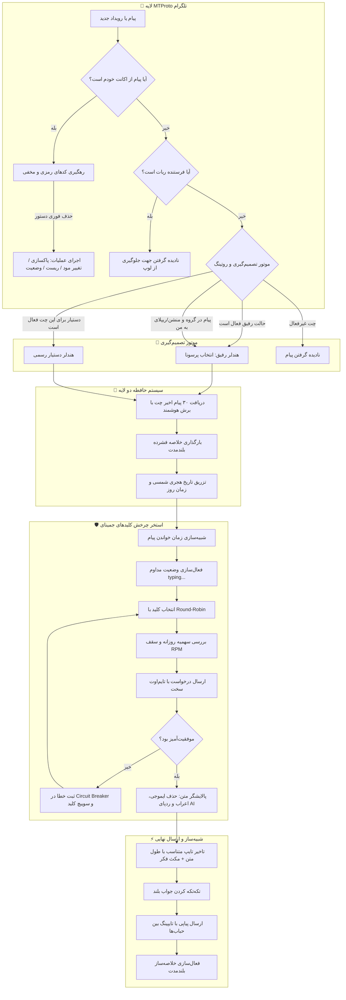

<div align="center" dir="rtl">

# 👻 روح‌گرام پرو (GhostGram PRO)
### *دستیار، رفیق و یوزربات مخفی تلگرام قدرت‌گرفته از هوش مصنوعی*

<p align="center">
  
  
  
  
  
  
  
</p>

<p align="center">
  <a href="#-قابلیتهای-برجسته"><b>✨ قابلیت‌ها</b></a> •
  <a href="#-راهنمای-کدهای-رمزی-و-مخفی"><b>🎮 دستورات</b></a> •
  <a href="#-دامنهٔ-دستیار-666-یا-666-all"><b>🎯 دامنهٔ دستیار</b></a> •
  <a href="#-شبیهساز-رفتار-انسانی"><b>⚡ رفتار انسانی</b></a> •
  <a href="#-معماری-حافطه-دو-لایه"><b>🧠 حافظه</b></a> •
  <a href="#-راهاندازی-و-نصب-سریع"><b>🚀 نصب سریع</b></a> •
  <a href="README.md"><b>🌐 English Version</b></a>
</p>

---

<p align="center">
  <b>روح‌گرام</b> یک یوزربات حرفه‌ای، کاملاً نامحسوس (Stealth) و خودکار تلگرام است که حساب کاربری شما را به <b>Google Gemini AI</b> وصل می‌کند.<br/>
  فارسی محاوره‌ای حرف می‌زند، پرسونای قابل تغییر دارد، رفتار خواندن و تایپ کردن انسان را موبه‌مو شبیه‌سازی می‌کند، جواب‌های بلند را مانند آدم واقعی تکه‌تکه می‌فرستد، حافطهٔ بلندمدت دارد، عکس و ویس و ویدئو و PDF را می‌فهمد، و با کدهای مخفی ۳ رقمی خودحذف‌شونده کنترل می‌شود.
</p>

---

</div>

<details dir="rtl">
<summary><b>📑 فهرست مطالب (برای باز کردن کلیک کنید)</b></summary>

- [✨ قابلیت‌های برجسته](#-قابلیتهای-برجسته)
- [🎮 راهنمای کدهای رمزی و مخفی](#-راهنمای-کدهای-رمزی-و-مخفی)
- [🎯 دامنهٔ دستیار: `666` یا `666 all`](#-دامنهٔ-دستیار-666-یا-666-all)
- [🏗️ معماری و جریان داده](#️-معماری-و-جریان-داده)
- [🎭 حالت‌های هوش مصنوعی و پرسونای پویا](#-حالتهای-هوش-مصنوعی-و-پرسونای-پویا)
- [⚡ شبیه‌ساز رفتار انسانی](#-شبیهساز-رفتار-انسانی)
- [🧬 معماری حافطه دو لایه](#-معماری-حافطه-دو-لایه)
- [🛡️ موتور مدیریت کلیدهای جمینای](#️-موتور-مدیریت-کلیدهای-جمینای)
- [🧹 پاکسازی روح (Ghost Purge)](#-پاکسازی-روح-ghost-purge)
- [🚀 راه‌اندازی و نصب سریع](#-راهاندازی-و-نصب-سریع)
- [⚙️ راهنمای تنطیمات محیطی (.env)](#️-راهنمای-تنطیمات-محیطی-env)
- [💾 فایل‌های وضعیت و مهاجرت](#-فایلهای-وضعیت-و-مهاجرت)
- [🔒 امنیت و پکیج‌ساز ایمن گیت‌هاب](#-امنیت-و-پکیجساز-ایمن-گیتهاب)
- [🗺️ نقشهٔ راه](#️-نقشهٔ-راه)
- [📄 لایسنس و سلب مسئولیت](#-لایسنس-و-سلب-مسئولیت)

</details>

---

## ✨ قابلیت‌های برجسته

<div dir="rtl">

<table>
  <tr>
    <td width="50%">
      <h3>🕶️ کدهای مخفی خودحذف‌شونده</h3>
      <p>کنترل کامل ربات از هر چتی با کدهای ۳ رقمی (<code>777</code>، <code>000</code>، <code>666</code>، <code>444</code>، <code>999</code>) که <b>بلافاصله پس از ارسال پاک می‌شوند</b>.</p>
    </td>
    <td width="50%">
      <h3>🤖 دو حالت اصلی هوش مصنوعی</h3>
      <p>سوییچ آنی میان <b>حالت رفیق</b> (لحن خودمانی شما) و <b>حالت دستیار</b> (منشی مودب ۲۴ ساعته) — حالا با <b>دامنهٔ چت‌به‌چت یا سراسری</b>.</p>
    </td>
  </tr>
  <tr>
    <td width="50%">
      <h3>🎭 موتور پرسونای نامحدود</h3>
      <p>ساخت فایل متنی دلخواه در <code>personas/*.txt</code> و تغییر زندهٔ لحن در چت (<code>777 lust</code>، <code>777 sarcastic</code>، <code>777 poetic</code>) بدون ریستارت.</p>
    </td>
    <td width="50%">
      <h3>🕵️ تعامل خودکار در گروه‌ها (Lurker)</h3>
      <p>بررسی منطم و پس‌زمینهٔ گفتگوها با خروجی ساختاریافتهٔ JSON و ورود طبیعی به بحث‌های جالب در فواصل تصادفی.</p>
    </td>
  </tr>
  <tr>
    <td width="50%">
      <h3>⚡ شبیه‌ساز رفتار و تایپ انسانی</h3>
      <p>تاخیر خواندن متناسب، <b>زمان تایپ متناسب با طول جواب تا ۴۵ ثانیه</b>، مکث‌های تصادفی فکر کردن و <b>تکه‌تکه فرستادن جواب‌های بلند</b>.</p>
    </td>
    <td width="50%">
      <h3>👁️ درک چندرسانه‌ای</h3>
      <p>فهم عکس، ویس، ویدیونوت و ویدیو (تا ~۱۸ مگابایت) و فایل‌های PDF و متنی — نه فقط متن ساده.</p>
    </td>
  </tr>
  <tr>
    <td width="50%">
      <h3>🧠 حافطه دو لایه هوشمند</h3>
      <p>نگهداری ۳۰ پیام آخر با برش هوشمند جملات، به همراه خلاصه‌ساز پس‌زمینه که فکت‌های کلیدی گفتگو را دائم ثبت می‌کند.</p>
    </td>
    <td width="50%">
      <h3>🛡️ استخر کلیدهای جمینای</h3>
      <p>چرخش Round-Robin روی نامحدود کلید API، کنترل سقف مصرف روزانه، کنترل نرخ درخواست و سیستم قطع مدار (Circuit Breaker).</p>
    </td>
  </tr>
</table>

</div>

---

## 🎮 راهنمای کدهای رمزی و مخفی

> [!IMPORTANT]
> **امنیت اختصاصی مالک**: تمامی کدهای رمزی تنها از طریق پیام‌های ارسالی خود شما (`event.out`) معتبرند. به محض دریافت، **دستور فوراً حذف می‌شود** و تأیید آن موقتاً در «پیام‌های ذخیره‌شده» شما نمایش داده می‌شود (قابل تنطیم با `STEALTH_CONFIRM`).

<div dir="rtl">

```
                  ┌─────────────────────────────────────────────────────────┐
                  │                 نقشه کدهای رمزی روح‌گرام               │
                  └────────────────────────────┬────────────────────────────┘
                                               │
             ┌───────────────────┬─────────────┴─────┬───────────────────┐
             ▼                   ▼                   ▼                   ▼
      [ موتور رفیق ]       [ تعامل گروهی ]     [ دستیار شخصی ]       [ ابزارها و حافطه ]
      • 777 (عادی)        • 777 engage        • 666 (همین چت)      • 111 (پاسخ هوشمند)
      • 777 <پرسونا>      • 777 engage <دقیقه>• 666 all (تمام پیوی)  • 333 (ریست حافطه)
      • 000 (خاموش چت)    • 777 engage auto   • 444 (سکوت این چت)   • 999 (پاکسازی پیام‌ها)
      • 000 all (خاموش کل)• 777 engage off    • 444 all (خاموش کل) • 555 (داشبورد وضعیت)
                                                                   • !مسدود (لیست سیاه)
                                                                   • 888 (نمایش راهنما)
```

### 📋 فهرست کامل دستورات

| کد مخفی | محدوده | عملکرد و توضیحات |
| :--- | :---: | :--- |
| `777` | چت جاری | **روشن کردن رفیق** با پرسونای پیش‌فرض (لحن خودمانی). |
| `777 <persona>` | چت جاری | **روشن کردن رفیق با لحن خاص** (مانند `777 lust`، `777 sarcastic`). |
| `000` | چت جاری | **خاموش کردن رفیق** در این گفتگو. |
| `000 all` | سراسری | **خاموش کردن رفیق در تمام چت‌ها**. |
| `777 engage` | گروه | **فعال‌سازی تعامل خودکار** (بررسی هر ۲۰ دقیقه). |
| `777 engage <min>` | گروه | **تعامل خودکار با فاصلهٔ دلخواه** (مانند `777 engage 35`). |
| `777 engage auto` | گروه | 🧠 **تعامل هوشمند**: سرعت گروه را می‌سنجد و فاصله را طوری تنطیم می‌کند که حضور ربات حدود ۵٪ پیام‌ها باشد (۲ تا ۱۲۰ دقیقه). |
| `777 engage off [all]` | گروه / سراسری | **خاموش کردن تعامل خودکار**. |
| **`666`** | **فقط همین چت** | 🆕 **روشن کردن دستیار فقط در چت جاری**. |
| **`666 all`** | **تمام پیوی‌ها** | **روشن کردن دستیار برای همهٔ پیوی‌ها** (فعلی و آینده). معادل‌ها: `666 کل`، `666 همه`. |
| `444` | چت جاری | **توقف دستیار فقط در این چت** (بقیهٔ پیوی‌ها روشن می‌مانند). |
| `444 all` / `444 کل` | تمام پیوی‌ها | **خاموش کردن کامل دستیار**. |
| `!مسدود` (روی پیام) | سراسری | **افزودن کاربر به لیست سیاه**: دستیار دیگر هرگز به او پاسخ نمی‌دهد (`!مسدود 123456` هم قبول است). |
| `!آزاد` (روی پیام) | سراسری | **حذف کاربر از لیست سیاه**. |
| `!استیکر <توضیح>` (روی استیکر) | سراسری | 🎭 **آموزش استیکر**: معنی‌اش را توضیح بده تا ربات سر جای مناسب بفرستد. |
| `!استیکر لیست` | سراسری | 🎭 لیست استیکرهای آموزش‌دیده. |
| `!استیکر حذف` (روی استیکر) | سراسری | 🎭 حذف استیکر از مخزن قابل ارسال. |
| `222` یا `222 <ساعت>` | گروه/پیوی | **خلاصه گفتگو**: جمع‌بندی خودمونی اتفاقات ۱۲ ساعت گذشته (تا ۷۲ ساعت) و پیام‌هایی که منتطر جواب شما بودند. |
| `112 <سوال>` | هرجا | **جستجوی وب**: پاسخ به‌روز با جستجوی گوگل (قیمت ارز، آب‌وهوا، اخبار). |
| `111` یا `111 <دستور>` | ریپلای | **پاسخ هوشمند** به پیامی که ریپلای زده‌اید (مثلاً `111 بگو فردا تماس می‌گیرم`). |
| `555 <یادآور>` | چت جاری | **یادآور هوشمند**: `555 ساعت 21 به علی بگو تماس بگیره` یا `555 تا ۲ ساعت دیگه دارو بخور`. |
| `333` | چت جاری | **ریست حافطه** کوتاه‌مدت و بلندمدت این چت. |
| `999` یا `999 <تعداد>` | چت جاری | **پاکسازی روح**: حذف همه (یا N پیام آخر) پیام‌های ارسالی شما. |
| `555` | چت جاری | **وضعیت زنده**: داشبورد وضعیت با حذف خودکار. |
| `888` | چت جاری | **راهنما**: نمایش منوی راهنما و لیست کدهای مخفی. |

### 🔔 بازخورد مخفی و گزارش خطا

- تأیید همهٔ دستورها به «پیام‌های ذخیره‌شده» خودتان می‌رود و بعد از چند ثانیه پاک می‌شود — هیچ ردی در چت مقصد باقی نمی‌ماند.
- اگر موتور هوش مصنوعی یا ارسال پیام خطا بدهد، گزارش دقیق به «پیام‌های ذخیره‌شده» می‌رود؛ دیگر هیچ خطایی بی‌صدا گم نمی‌شود (با `NOTIFY_ERRORS=0` غیرفعال می‌شود).

### 👁️ درک چندرسانه‌ای

وقتی حالت «رفیق» (`777`) یا «دستیار» (`666`) فعال باشد، ربات دیگر فقط متن نمی‌فهمد:

- 📷 **عکس** بفرستید → محتوای عکس تحلیل می‌شود و طبیعی جواب می‌دهد.
- 🎙️ **ویس** بفرستید → صدا شنیده و فهمیده می‌شود.
- 🎬 **ویدیونوت و ویدیو** بفرستید → محتوای ویدئو دیده می‌شود (تا ~۱۸ مگابایت).
- 📄 **PDF و فایل متنی** بفرستید → محتوای فایل خوانده و تحلیل می‌شود.

*(یادآورها در `reminders_state.json` ذخیره می‌شوند و با ری‌استارت از بین نمی‌روند.)*

</div>

---

## 🎯 دامنهٔ دستیار: `666` یا `666 all`

<div dir="rtl">

قبلاً دستیار یا در همه‌جا روشن بود یا هیچ‌جا. حالا **دو لایه** دارد تا بتوانی منشی را فقط برای یک نفر خاص بگذاری بدون اینکه همهٔ پیوی‌هایت درگیر شوند.

| دستور | نتیجه |
|---|---|
| `666` | دستیار **فقط در همان چتی که فرستادی** روشن می‌شود. برای هر چت دیگر هم جداگانه بفرست. |
| `666 all` | دستیار برای **تمام پیوی‌ها** روشن می‌شود، شامل کسانی که بعداً پیام می‌دهند. معادل‌ها: `666 کل`، `666 همه`، `666 همه‌چت‌ها`. |
| `666 <چیز دیگر>` | با هشدار رد می‌شود — یک غلط تایپی هرگز تو را بی‌سروصدا به حالت سراسری نمی‌برد. |
| `444` | دستیار در این چت ساکت می‌شود (و از لیست چت‌های فعال هم حذف می‌شود). |
| `444 all` | دستیار کاملاً خاموش می‌شود: حالت سراسری، لیست چت‌ها و سکوت‌ها پاک می‌شوند. |

داشبورد `555` دقیقاً می‌گوید کدام لایه فعال است و چند چت تک‌به‌تک روشن شده‌اند.

> [!WARNING]
> **مهاجرت یک‌باره.** فایل‌های وضعیتی که قبل از این تغییر نوشته شده‌اند در اولین اجرا ارتقا می‌یابند و دستیار **خاموش** می‌شود تا بی‌سروصدا به همهٔ پیوی‌ها جواب ندهد. بعد از آپدیت، در چت‌هایی که می‌خواهی `666` بزن یا یک‌بار `666 all` بفرست. لیست سیاه و چت‌های ساکت‌شده دست‌نخورده می‌مانند.

</div>

---

## 🏗️ معماری و جریان داده



---

## 🎭 حالت‌های هوش مصنوعی و پرسونای پویا

<div dir="rtl">

### ۱. حالت رفیق (Alter-Ego)
با کد `777` ربات درست مثل خود شما رفتار می‌کند؛ لحن عامیانه، پاسخ‌های کوتاه بدون ایموجی و ارجاع دقیق به سوابق گفتگو. در گروه‌ها تنها وقتی جواب می‌دهد که روی شما ریپلای بزنند یا منشنتان کنند.

### ۲. حالت دستیار شخصی
با `666` برای یک چت و با `666 all` برای همهٔ پیوی‌ها فعال می‌شود. نقش منشی موقر شما را بازی می‌کند، به مراجعین پاسخ محترمانه می‌دهد و پیام می‌گیرد. با `444` می‌توانید در چت‌های خاص بی‌صدایش کنید.

### ۳. تعامل خودکار در گروه‌ها (Auto-Engage)
با `777 engage <دقیقه>` ربات سوابق گروه را هر چند دقیقه یک‌بار بررسی می‌کند و اگر بحث جالبی در جریان باشد، هوشمندانه وارد می‌شود. با `777 engage auto` فاصله را خودش بر اساس سرعت واقعی گروه انتخاب می‌کند.

### ۴. سیستم تعویض زندهٔ پرسوناها
کافیست هر فایل متنی با پسوند `.txt` را درون پوشهٔ `personas/` قرار دهید:

```
personas/
├── normal.txt          <- لحن عامیانه و پیش‌فرض
├── assistant.txt       <- لحن منشی محترمانه
├── sarcastic.txt       <- لحن طعنه‌زن و تیکه‌دار
├── poetic.txt          <- لحن شاعرانه و دراماتیک
├── academic.txt        <- لحن رسمی و علمی
├── angry.txt           <- لحن عصبی و رک
├── drunk.txt           <- لحن صمیمی و بی‌فیلتر
└── lust.txt            <- لحن محبت‌آمیز و دلنشین
```

> [!TIP]
> برای لحن جدید کافیست فایلی مانند `personas/gamer.txt` بسازید و با `777 gamer` فعالش کنید — بدون ریستارت!

</div>

---

## ⚡ شبیه‌ساز رفتار انسانی

<div dir="rtl">

بزرگ‌ترین نشانهٔ روبات بودن یک یوزربات این نیست که *چه* می‌نویسد؛ این است که *چقدر سریع* می‌نویسد. یک پاراگراف ۴۰۰ کاراکتری که بعد از ۳ ثانیه بیاید، برای انگشت انسان غیرممکن است. پس کل خط لولهٔ ارسال انسانی‌سازی شده است:

۱. **تاخیر خواندن متناسب** پیش از شروع تایپ، تا واقعاً مثل خواندن پیام به نطر برسد.
۲. **زمان تایپ متناسب با طول متن** روی منحنی غیرخطی، با سقف **۴۵ ثانیه** جای سقف خشک ۷ ثانیه‌ای قدیم. جواب کوتاه سریع می‌رسد، جواب بلند واقعاً طول می‌کشد.
۳. **مکث‌های تصادفی فکر کردن** در میانهٔ تایپ، تا علامت `typing…` درست مانند انسان روشن و خاموش شود.
۴. **تکه‌تکه فرستادن خودکار**: جواب‌های بلندتر از آستانه از مرز جملات بریده و به صورت **چند پیام جداگانه** با تایپینگ کوتاه بینشان فرستاده می‌شوند — دقیقاً مانند رفتار واقعی آدم‌ها. کد و استیکر هرگز تکه نمی‌شوند.
۵. **پالایشگر خروجی ضد ربات**: حذف ایموجی، اعراب عربی، تگ‌های HTML و لیست‌های مارک‌داون پیش از ارسال.

**زمان‌بندی تقریبی:**

| طول جواب | زمان تایپ |
|---|---|
| ~۵ کاراکتر | ~۱.۲ ثانیه |
| ~۵۰ کاراکتر | ~۱۵ ثانیه |
| ~۱۵۰ کاراکتر | ~۵۰ ثانیه (تکه‌تکه می‌شود) |
| بیش از ۴۰۰ کاراکتر | سقف ۴۵ ثانیه برای هر حباب |

تمام این اعداد با متغیرهای `HUMAN_*` قابل تنطیم‌اند — به بخش تنطیمات مراجعه کنید.

</div>

---

## 🧬 معماری حافطه دو لایه

<div dir="rtl">

- **حافطه کوتاه‌مدت**: واکشی ۳۰ پیام اخیر با ساختار فرستنده، زمان و رشتهٔ ریپلای‌ها. پیام‌های طولانی از انتهای جملات هوشمندانه کوتاه می‌شوند.
- **خلاصه‌ساز بلندمدت پس‌زمینه**: هر ۳۰ پیام، یک تسک ناهمگام مهم‌ترین فکت‌ها را فشرده کرده و در `memory_state.json` ذخیره می‌کند.
- **ریست آنی حافطه (`333`)**: واترمارک زمانی ریست و کلیهٔ سوابق کوتاه‌مدت و خلاصهٔ بلندمدت آن چت فوراً پاک می‌شود.

</div>

---

## 🛡️ موتور مدیریت کلیدهای جمینای

<div dir="rtl">

- **چرخش خودکار کلیدها (Round-Robin)**: پشتیبانی از تعداد نامحدود کلید در `apis.txt` یا `.env`.
- **سقف دلخواه به ازای هر مدل**: با `GEMINI_MODELS="name:rpm:rpd,..."` و مقادیر پیش‌فرض `DEFAULT_MODEL_RPM` / `DEFAULT_MODEL_RPD`.
- **شمارنده سهمیه روزانه**: ثبت مصرف هر کلید در `api_usage.json` با سقف ایمن زیر حد گوگل.
- **سیستم قطع مدار (Circuit Breaker)**: کلیدی که ۳ بار پیاپی خطا بدهد، ۳ ساعت قرنطینه می‌شود.
- **تایم‌اوت سخت**: با `GEMINI_TIMEOUT` و بازهٔ طولانی‌تر `SEARCH_TIMEOUT` برای جستجوی وب.

</div>

---

## 🧹 پاکسازی روح (Ghost Purge)

<div dir="rtl">

با ارسال کد `999`:
- تمامی پیام‌های ارسالی شما در چت در دسته‌های ۵۰ تایی حذف می‌شوند.
- خطاهای محدودیت سرعت تلگرام (`FloodWaitError`) خودکار مدیریت می‌شوند.
- خود کد `999` پیش از شروع پاکسازی ناپدید می‌شود.

</div>

---

## 🚀 راه‌اندازی و نصب سریع

<div dir="rtl">

### روش اول: Railway (پیشنهادی برای اجرای ۲۴ ساعته)

۱. این ریپو را فورک/کلون کنید و یک سرویس Railway از روی آن بسازید.
۲. یک **Volume** بسازید و در مسیر `/app/data` وصل کنید — بدون آن، حافطه، یادآورها و وضعیت مودها با هر ری‌استارت پاک می‌شوند.
۳. روی 